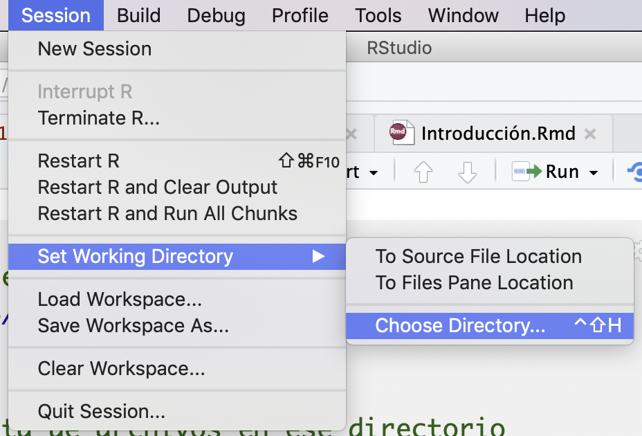

```{r setup, include=FALSE}
knitr::opts_chunk$set(echo = TRUE)
```

# Primer acercamiento al uso del programa
En RStudio podemos tener varias ventanas que nos permiten tener más control de nuestro "ambiente", el historial, los "scripts" o códigos que escribimos y por supuesto, tenemos nuestra consola, que también tiene el símbolo ">" con R. Podemos pedir operaciones básicas

```{r 2}
2+5
5*3

#Para escribir comentarios y que no los lea como operaciones ponemos el símbolo de gato
# Lo podemos hacer para un comentario en una línea o la par de una instrucción
1:5               # Secuencia 1-5

seq(1, 10, 0.5)   # Secuencia con incrementos diferentes a 1

c('a','b','c')  # Vector con caracteres
1:7             # Entero
40<80           # Valor logico
2+2 == 5        # Valor logico
T == TRUE       # T expresion corta de verdadero

```

R es un lenguaje de programación por objetos. Por lo cual vamos a tener objetos a los que se les asigna su contenido. Si usamos una flechita "<-" o "->" le estamos asignando algo al objeto que apunta la felcha.

```{r 3}
x <- 24         # Asignacion de valor 24 a la variable x para su uso posterior (OBJETO)
x/2             # Uso posterior de variable u objeto x
x               # Imprime en pantalla el valor de la variable u objeto
x <- TRUE       # Asigna el valor logico TRUE a la variable x OJO: x toma el ultimo valor que se le asigna
x
```
## Vectores
Los vectores son uno de los objetos más usados en R. 
```{r 4}
y <- c(2,4,6)     # Vector numerico
y <- c('Primaria', 'Secundaria') # Vector caracteres
```
Dado que poseen elementos, podemos también observar y hacer operaciones con sus elementos, usando "[ ]" para acceder a ellos
```{r 5}
y[2]              # Acceder al segundo valor del vector y
y[3] <- 'Preparatoria y más' # Asigna valor a la tercera componente del vector
sex <-1:2         # Asigna a la variable sex los valores 1 y 2
names(sex) <- c("Femenino", "Masculino") # Asigna nombres al vector de elementos sexo
sex[2]            # Segundo elemento del vector sex

```


## Matrices
Las matrices son muy importantes, porque nos permiten hacer operaciones y casi todas nuestras bases de datos tendran un aspecto de matriz.

```{r}
m <- matrix (nrow=2, ncol=3, 1:6, byrow = TRUE) # Matrices Ejemplo 1
m

m <- matrix (nrow=2, ncol=3, 1:6, byrow = FALSE) # Matrices Ejemplo 1
m
dim(m)
attributes(m)
n <- 1:6     # Matrices Ejemplo 2
dim(n) <- c(2,3)
n
xx <-10:12   # Matrices Ejemplo 3
yy<-14:16
cbind(xx,yy) # Une vectores por Columnas
rbind(xx,yy) # Une vectores por Renglones

mi_matrix<-cbind(xx,yy) # este resultado lo puedo asignar a un objeto
```


## Funciones
Algunas funciones básicas son las siguientes. Vamos a ir viendo más funciones, pero para entender cómo funcionan, haremos unos ejemplos y cómo pedir ayuda sobre ellas.

```{r 6}
sum (10,20,30)    # Función suma
rep('R', times=3) # Repite la letra R el numero de veces que se indica
sqrt(9)           # Raiz cuadrada de 9

```

## Ayuda
Pedir ayuda es indispensable para aprender a escribir nuestros códigos. A prueba y error, es el mejor sistema para aprender. Podemos usar la función help, example y ?

```{r 7}
help(sum)         # Ayuda sobre función sum
example(sum)      # Ejemplo de función sum
```

## Mi ambiente
Todos los objetos que hemos declarado hasta ahora son parte de nuestro "ambiente" (environment). Para saber qué está en nuestro ambiente usamos el comando
```{r 8}
ls()
gc()           # Garbage collection, reporta memoria en uso
```
Para borrar todos nuestros objetos, usamos el siguiente comando, que equivale a usar la escobita de la venta de environment
```{r 9}
rm(list=ls())  # Borrar objetos actuales
```

## Directorio de trabajo

Es muy útil saber dónde estamos trabajando y donde queremos trabajar. Por eso podemos utilizar los siguientes comandos para saberlo

Ojo, checa, si estás desdes una PC, cómo cambian las "\" por "/" o por  "\\"
```{r 10}
getwd()           # Directorio actual
setwd("/Users/anaescoto/Dropbox/2020/CursoR-posgrado-pol")# Cambio de directorio

list.files()      # Lista de archivos en ese directorio
```
Checar que esto también se puede hacer desde el menú:

 

# Instalación de librerías
Las librerías son útiles para realizar funciones especiales. La especialización de paquetes es más rápida en R que en otros programas por ser un software libre. 

Vamos a instalar el paquete "foreign", como su nombre lo indica, nos permite leer elementos "extranjeros" en R. Es sumamente útil porque nos permite leer casi todos los formatos, sin necesidad de usar paquetes especializados como <i>StatTransfer</i>.

Para instalar las paqueterías usamos el siguiente comando "install.packages()"
Checa que adentro del paréntesis va el nombre de la librería, con comillas. 

Con la opción "dependencies = TRUE" R nos instalará no sólo la librería o paquete que estamos pidiendo, sino todo aquellos paquetes que necesite la librería en cuestión. Muchas veces los diseños de los paquetes implican el uso de algún otro anterior. Por lo que poner esta sentencia nos puede ahorrar errores cuando estemos usando el paquete. Piensa que esto es similar a cuando enciendes tu computadora y tu sistema operativo te pide que mantengas las actualizaciones. 

Vamos a instalar dos librerías que nos permiten importar formatos.

```{r 11}
install.packages("foreign", dependencies = TRUE)
install.packages("haven", dependencies = TRUE)

```

Este proceso no hay que hacerlo siempre. Si no sólo la primera vez. Una vez instalado un paquete de librería, la llamamos con el comando "library"

```{r 12}
library(foreign)
library(haven)
```

"foreing" nos permite leer archivos en formato de dBase, con extensión ".dbf". Si bien no es un formato muy común para los investigadores, sí para los que generan la información, puesto que dBase es uno de los principales programas de administración de bases de datos. 

He puesto un ejemplo de una base de datos mexicana en dbf, en este formato.

```{r}
ecovid0420<-read.dbf("./datos/ecovid0420.DBF") #checa cómo nos vamos adentro de nuestro directorio
```

# Ejercicio
En su proyecto en rstudio.cloud, realice en nuevo script lo siguiente:

1. Escriba un vector "x", con los elementos 2,3,7,9. Muestre el resultado
2. Escriba un vector "y", con los elementos 9, 7, 3, 2. Muestre el resultado
3. Escriba un vector "year" con los años que van desde 1990 a 1993. Muestre el resultado
4. Escriba un vector "name" con los nombres de 4 de sus compañeros de curso. Muestre el resultado
5. Cree una matrix “m”  2x4 que incluya los valores 101 a 108, que se ordene según fila
6. ¿Cuáles son las dimensiones de la matriz "m"?
7. Cree una matriz "m2" juntado los vectores “x” y “y”, por sus filas
8. ¿Cuáles son las dimensiones de la matriz "m2"?

Descargue el código y envíelo a través del siguiente formulario:
<https://forms.gle/ExHBf4zszs5evwro6> 
