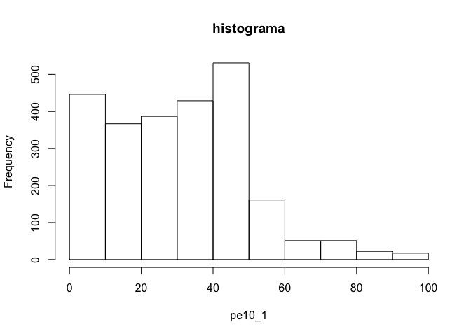
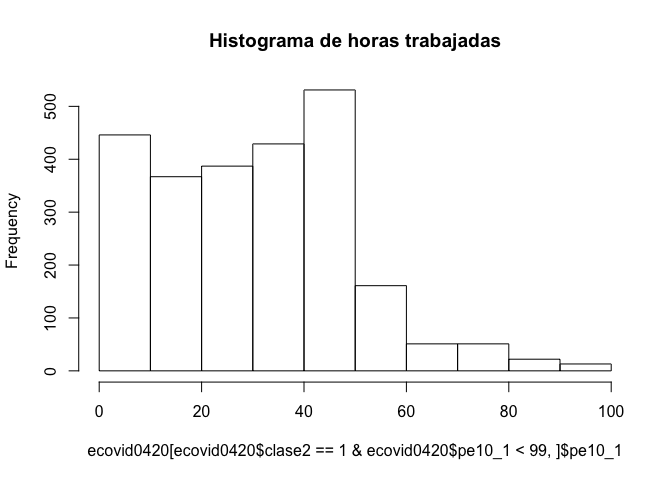
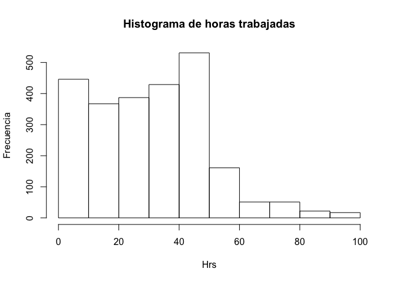
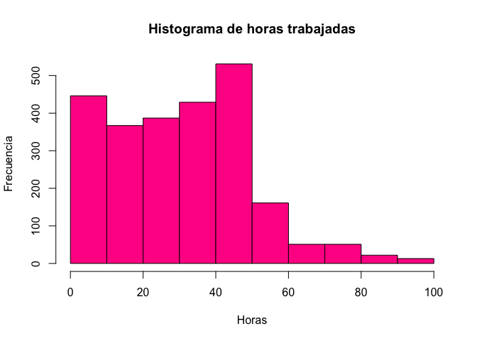

Práctica 3 - Manejo de datos
================
AE & ML
24/08/2020

# Previo

Vamos a importar de nuevo de la ECOVID-ML, una nueva fuente desarrollada
por INEGI. <https://www.inegi.org.mx/investigacion/ecovidml/2020/>

Vamos a llamar algunas librerías básicas, el tidyverse (que son muchas
librerías) y sjlabelled que nos sirve para el manejo de etiquetas

``` r
if (!require("pacman")) install.packages("pacman") # instala pacman si se requiere
```

    ## Loading required package: pacman

``` r
pacman::p_load(tidyverse, haven, sjlabelled, foreign, janitor) #carga los paquetes necesarios para esta práctica
```

Por si no tuviéramos cargada la base de datos, la volveremos a cargar

``` r
ecovid0420 <- read_dta("./datos/ecovid0420.dta")
```

# Continuación “Subsetting”

## Selección “inversa”

O sea no “botar algo”, es con el negativo. No funciona con todos los
formatos

``` r
x<-ecovid0420 %>% 
  select(-pb3)
x<-ecovid0420[,-10]

rm(x) #rm sólo bota objetos
```

Pero con los otros formatos podemos “asignar” valores adentro de un
data.frame, y uno de eso valores puede ser “la nada”"

``` r
ecovid0420$pb3_2<-ecovid0420$pb3
ecovid0420$pb3_2<-NULL
```

De aquí viene esa cuesta en el aprendizaje; tenemos que comprender en
qué forma programó el que hizo la librería e incluso a veces cómo
aprendió quién te está enseñando o el foro que estás leyendo.

# Subsetting

Rara vez utilizamos una base de datos completa, y rara vez queremos
hacer operaciones completas con ellas.

Vamos a pedir cosas más específicas y podemos seleccionar observaciones
o filas. Como nuestra base de datos es muy grande, guardaremos el filtro
o selección en un objeto.

``` r
subset1<-ecovid0420[ecovid0420$pb3>4,]
```

También podemos seleccionar columnas

``` r
subset2<- ecovid0420[, c("pb1", "pb2", "pb3")]
```

podemos combinar los dos tipos de selección

``` r
subset3<- ecovid0420[(ecovid0420$pb3>4 & ecovid0420$pb1==1 ), c("pb1", "pb2", "pb3")]
```

Con dplyr, podemos usar “filter” y “select”

``` r
subset4<-ecovid0420 %>% 
  filter(pb3>4 & pb1==1) %>%
    select(pb1, pb2, pb3)
```

# Variables nominales

La variable nominal “pb1”, se captura con “1” para hombres y con un “2”
para mujeres en la base de datos. Podemos establecer una operación de
igual y además sumar los casos que cumplan con esta condición:

``` r
ecovid0420 %>% count(pb1==2) # cuentan los casos que cumplen con la condición "pb1==2"
```

    ## # A tibble: 2 x 2
    ##   `pb1 == 2`     n
    ##   <lgl>      <int>
    ## 1 FALSE       2393
    ## 2 TRUE        3200

Esto es a lo que nos referimos con contar frecuencias. Podemos contar
casos que cumplan con una operación de igualdad.

``` r
ecovid0420 %>% with(table(pb1))
```

    ## pb1
    ##    1    2 
    ## 2393 3200

Con “tabyl()”" de “janitor”"

``` r
ecovid0420 %>% mutate(pb1=as_label(pb1))  %>% tabyl(pb1)
```

    ##     pb1    n   percent
    ##  Hombre 2393 0.4278562
    ##   Mujer 3200 0.5721438

Para ver que esto es una distribución de frecuencias sería muy útil ver
la proporción total, ello se realiza agregando un elemento más en
nuestro código con una “tubería”:

``` r
ecovid0420 %>% mutate(pb1=as_label(pb1))  %>% tabyl(pb1) %>% adorn_totals()
```

    ##     pb1    n   percent
    ##  Hombre 2393 0.4278562
    ##   Mujer 3200 0.5721438
    ##   Total 5593 1.0000000

Hoy revisamos algunos tipos de variables

``` r
class(ecovid0420$pb1) # variable sin etiqueta
```

    ## [1] "haven_labelled" "vctrs_vctr"     "double"

``` r
class(as_label(ecovid0420$pb1)) # variable con etiqueta
```

    ## [1] "factor"

``` r
class(as_label(ecovid0420$pb3)) # variable ordinal
```

    ## [1] "factor"

``` r
class(as_label(ecovid0420$pe10_1)) # variable de intervalo/razón
```

    ## [1] "numeric"

En general, tendremos variables de factor que podrían ser consideradas
como cualitativas y numéricas. Aunque en realidad, R tiene muchas formas
de almacenamiento. Como mostramos con el comando “glimpse()” en capítulo
anterior, podemos revisar una variable en específico:

``` r
glimpse(ecovid0420$pb1)
```

    ##  dbl+lbl [1:5593] 1, 1, 1, 1, 2, 1, 1, 1, 1, 1, 1, 1, 1, 1, 1, 1, 1, 1, 1, ...
    ##  @ label       : chr "Sexo"
    ##  @ format.stata: chr "%10.0g"
    ##  @ labels      : Named num [1:2] 1 2
    ##   ..- attr(*, "names")= chr [1:2] "Hombre" "Mujer"

``` r
ecovid0420 %>% mutate(pb1=as_label(pb1)) %>% # cambia los valores de la variable a sus etiquetas
                tabyl(pb1) %>% # para hacer la tabla
                adorn_totals() %>% # añade totales
                adorn_pct_formatting()  # nos da porcentaje en lugar de proporción
```

    ##     pb1    n percent
    ##  Hombre 2393   42.8%
    ##   Mujer 3200   57.2%
    ##   Total 5593  100.0%

La tubería o “pipe” %\>% nos permite ir agregando elementos de manera
sencilla nuestros comandos. En este caso decimos que dentro del objeto
haga el cambio, luego la tabla, que le ponga porcentajes y finalmente
que nos dé los totales. El total del 100% no aparece, por un elemento
propio del programa.

### Variables ordinales

Son variables que dan cuenta de cualidades o condiciones a través de
categorías que guardan un orden entre sí.

Vamos a darle una “ojeada” a esta variable

``` r
glimpse(ecovid0420$pb3)
```

    ##  dbl+lbl [1:5593] 3, 2, 2, 4, 3, 2, 3, 3, 2, 8, 2, 3, 1, 2, 2, 3, 8, 3, 0, ...
    ##  @ label       : chr "escolaridad"
    ##  @ format.stata: chr "%33.0g"
    ##  @ labels      : Named num [1:10] 0 1 2 3 4 5 6 7 8 9
    ##   ..- attr(*, "names")= chr [1:10] "Ninguno" "Preescolar" "Primaria" "Secundaria" ...

Hoy hacemos la tabla, con las etiquetas:

``` r
ecovid0420 %>% mutate(pb3=as_label(pb3)) %>% 
                tabyl(pb3)
```

    ##                               pb3    n     percent
    ##                           Ninguno  153 0.027355623
    ##                        Preescolar   34 0.006079027
    ##                          Primaria 1173 0.209726444
    ##                        Secundaria 1526 0.272841051
    ##       Preparatoria o bachillerato 1272 0.227427141
    ##  Técnicos con primaria/secundaria  165 0.029501162
    ##       Estudios técnicos con prepa   76 0.013588414
    ##             Normal con secundaria   29 0.005185053
    ##             Licenciatura o normal 1037 0.185410334
    ##                          Posgrado  128 0.022885750

Para que no nos salgan las categorías sin datos podemos poner una opción
dentro del comando “tabyl()”

``` r
ecovid0420 %>% 
  mutate(pb3=as_label(pb3)) %>% 
                tabyl(pb3, show_missing_levels=F ) %>% # esta opción elimina los valores con 0
                adorn_totals()  
```

    ##                               pb3    n     percent
    ##                           Ninguno  153 0.027355623
    ##                        Preescolar   34 0.006079027
    ##                          Primaria 1173 0.209726444
    ##                        Secundaria 1526 0.272841051
    ##       Preparatoria o bachillerato 1272 0.227427141
    ##  Técnicos con primaria/secundaria  165 0.029501162
    ##       Estudios técnicos con prepa   76 0.013588414
    ##             Normal con secundaria   29 0.005185053
    ##             Licenciatura o normal 1037 0.185410334
    ##                          Posgrado  128 0.022885750
    ##                             Total 5593 1.000000000

# Bivariado cualitativo

### Cálculo de frecuencias

Las tablas de doble entrada tiene su nombre porque en las columnas
entran los valores de una variable categórica, y en las filas de una
segunda. Basicamente es como hacer un conteo de todas las combinaciones
posibles entre los valores de una variable con la otra.

Por ejemplo, si quisiéramos combinar las dos variables que ya estudiamos
lo podemos hacer, con una tabla de doble entrada:

``` r
ecovid0420 %>% 
  mutate(pb3=as_label(pb3)) %>% # para que las lea como factor
  mutate(pb1=as_label(pb1)) %>% # para que las lea como factor
                tabyl(pb3, pb1, show_missing_levels=F ) %>% # incluimos aquí 
                adorn_totals()  
```

    ##                               pb3 Hombre Mujer
    ##                           Ninguno     58    95
    ##                        Preescolar     16    18
    ##                          Primaria    465   708
    ##                        Secundaria    592   934
    ##       Preparatoria o bachillerato    600   672
    ##  Técnicos con primaria/secundaria     41   124
    ##       Estudios técnicos con prepa     27    49
    ##             Normal con secundaria     13    16
    ##             Licenciatura o normal    510   527
    ##                          Posgrado     71    57
    ##                             Total   2393  3200

Observamos que en cada celda confluyen los casos que comparten las
mismas características:

``` r
ecovid0420 %>%   
    count(pb3==1 & pb1==1) # nos da la segunda celda de la izquierda
```

    ## # A tibble: 2 x 2
    ##   `pb3 == 1 & pb1 == 1`     n
    ##   <lgl>                 <int>
    ## 1 FALSE                  5577
    ## 2 TRUE                     16

### Totales y porcentajes

De esta manera se colocan todos los datos. Si observa al poner la
función “adorn\_totals()” lo agregó como una nueva fila de totales,
pero también podemos pedirle que agregue una columna de totales.

``` r
ecovid0420 %>% 
  mutate(pb3=as_label(pb3)) %>% # para que las lea como factor
  mutate(pb1=as_label(pb1)) %>% # para que las lea como factor
    tabyl(pb3, pb1, show_missing_levels=F ) %>% # incluimos aquí pb1o
                adorn_totals("col")  
```

    ##                               pb3 Hombre Mujer Total
    ##                           Ninguno     58    95   153
    ##                        Preescolar     16    18    34
    ##                          Primaria    465   708  1173
    ##                        Secundaria    592   934  1526
    ##       Preparatoria o bachillerato    600   672  1272
    ##  Técnicos con primaria/secundaria     41   124   165
    ##       Estudios técnicos con prepa     27    49    76
    ##             Normal con secundaria     13    16    29
    ##             Licenciatura o normal    510   527  1037
    ##                          Posgrado     71    57   128

O bien agregar los dos, introduciendo en el argumento “c(”col“,”row“)”
un vector de caracteres de las dos opciones requeridas:

``` r
ecovid0420 %>% 
  mutate(pb3=as_label(pb3)) %>% # para que las lea como factor
  mutate(pb1=as_label(pb1)) %>% # para que las lea como factor
                tabyl(pb3, pb1, show_missing_levels=F ) %>% # incluimos aquí pb1o
                adorn_totals(c("col", "row")) 
```

    ##                               pb3 Hombre Mujer Total
    ##                           Ninguno     58    95   153
    ##                        Preescolar     16    18    34
    ##                          Primaria    465   708  1173
    ##                        Secundaria    592   934  1526
    ##       Preparatoria o bachillerato    600   672  1272
    ##  Técnicos con primaria/secundaria     41   124   165
    ##       Estudios técnicos con prepa     27    49    76
    ##             Normal con secundaria     13    16    29
    ##             Licenciatura o normal    510   527  1037
    ##                          Posgrado     71    57   128
    ##                             Total   2393  3200  5593

Del mismo modo, podemos calcular los porcentajes. Pero los podemos
calcular de tres formas. Uno es que lo calculemos para los totales
calculados para las filas, para las columnas o para el gran total
poblacional.

Para columnas tenemos el siguiente código y los siguientes resultados:

``` r
ecovid0420 %>% 
  mutate(pb3=as_label(pb3)) %>% # para que las lea como factor
  mutate(pb1=as_label(pb1)) %>% # para que las lea como factor
  tabyl(pb3, pb1, show_missing_levels=F ) %>% # incluimos aquí sexo
                adorn_totals(c("col", "row")) %>% 
                adorn_percentages("col") %>% # Divide los valores entre el total de la columna
                adorn_pct_formatting() # lo vuelve porcentaje
```

    ##                               pb3 Hombre  Mujer  Total
    ##                           Ninguno   2.4%   3.0%   2.7%
    ##                        Preescolar   0.7%   0.6%   0.6%
    ##                          Primaria  19.4%  22.1%  21.0%
    ##                        Secundaria  24.7%  29.2%  27.3%
    ##       Preparatoria o bachillerato  25.1%  21.0%  22.7%
    ##  Técnicos con primaria/secundaria   1.7%   3.9%   3.0%
    ##       Estudios técnicos con prepa   1.1%   1.5%   1.4%
    ##             Normal con secundaria   0.5%   0.5%   0.5%
    ##             Licenciatura o normal  21.3%  16.5%  18.5%
    ##                          Posgrado   3.0%   1.8%   2.3%
    ##                             Total 100.0% 100.0% 100.0%

Cuando se hagan cuadros de distribuciones (que todas sus partes suman
100), los porcentajes pueden ser una gran ayuda para la interpretación,
sobre todos cuando se comparar poblaciones de categorías de diferente
tamaño. Por lo general, queremos que los cuadros nos den información de
donde están los totales y su 100%, de esta manera el lector se puede
guiar de porcentaje con respecto a qué está leyendo. En este caso, vemos
que el 100% es común en la última fila.

Veamos la diferencia de cómo podemos leer la misma celda, pero hoy,
hemos calculado los porcentajes a nivel de fila:

``` r
ecovid0420 %>% 
  mutate(pb3=as_label(pb3)) %>% # para que las lea como factor
  mutate(pb1=as_label(pb1)) %>% # para que las lea como factor
                tabyl(pb3, pb1, show_missing_levels=F ) %>% 
                adorn_totals(c("col", "row")) %>% 
                adorn_percentages("row") %>% # Divide los valores entre el total de la fila
                adorn_pct_formatting() # lo vuelve porcentaje
```

    ##                               pb3 Hombre Mujer  Total
    ##                           Ninguno  37.9% 62.1% 100.0%
    ##                        Preescolar  47.1% 52.9% 100.0%
    ##                          Primaria  39.6% 60.4% 100.0%
    ##                        Secundaria  38.8% 61.2% 100.0%
    ##       Preparatoria o bachillerato  47.2% 52.8% 100.0%
    ##  Técnicos con primaria/secundaria  24.8% 75.2% 100.0%
    ##       Estudios técnicos con prepa  35.5% 64.5% 100.0%
    ##             Normal con secundaria  44.8% 55.2% 100.0%
    ##             Licenciatura o normal  49.2% 50.8% 100.0%
    ##                          Posgrado  55.5% 44.5% 100.0%
    ##                             Total  42.8% 57.2% 100.0%

Finalmente, podemos calcular los porcentajes con referencia a la
población total en análisis. Es decir la celda en la esquina inferior
derecha de nuestra tabla original.

``` r
ecovid0420 %>% 
  mutate(pb3=as_label(pb3)) %>% # para que las lea como factor
  mutate(pb1=as_label(pb1)) %>% # para que las lea como factor
                tabyl(pb3, pb1, show_missing_levels=F ) %>% # incluimos aquí pb1o
                adorn_totals(c("col", "row")) %>% 
                adorn_percentages("all") %>% # Divide los valores entre el total de la población
                adorn_pct_formatting() # lo vuelve porcentaje
```

    ##                               pb3 Hombre Mujer  Total
    ##                           Ninguno   1.0%  1.7%   2.7%
    ##                        Preescolar   0.3%  0.3%   0.6%
    ##                          Primaria   8.3% 12.7%  21.0%
    ##                        Secundaria  10.6% 16.7%  27.3%
    ##       Preparatoria o bachillerato  10.7% 12.0%  22.7%
    ##  Técnicos con primaria/secundaria   0.7%  2.2%   3.0%
    ##       Estudios técnicos con prepa   0.5%  0.9%   1.4%
    ##             Normal con secundaria   0.2%  0.3%   0.5%
    ##             Licenciatura o normal   9.1%  9.4%  18.5%
    ##                          Posgrado   1.3%  1.0%   2.3%
    ##                             Total  42.8% 57.2% 100.0%

# Descriptivos para variables cuantitativas

Vamos a empezar a revisar los gráficos para variables cuantitativas.

## Medidas numéricas básicas

5 números

``` r
summary(ecovid0420$pe10_1) ## horas trabajadas
```

    ##    Min. 1st Qu.  Median    Mean 3rd Qu.    Max.    NA's 
    ##    1.00   16.00   35.00   32.65   48.00   99.00    3131

Con pipes se pueden crear “indicadores” de nuestras variables es un
tibble

``` r
ecovid0420 %>% 
  summarise(nombre_indicador=mean(pe10_1))
```

    ## # A tibble: 1 x 1
    ##   nombre_indicador
    ##              <dbl>
    ## 1               NA

## Histograma básico

``` r
hist(ecovid0420$pe10_1)
```

<!-- -->

A veces, para asegurarnos que tenemos los casos, nuestro análisis lo
hacemos filtrando a quiénes reportaron estar ocupados y ese 99 parece
ser una codificación de quienes no respondieron.

``` r
hist(ecovid0420[ecovid0420$clase2==1 & ecovid0420$pe10_1<99,]$pe10_1)
```

<!-- -->

Podemos modificarlo de a poco a poco. Modificar el título

``` r
hist(ecovid0420[ecovid0420$clase2==1 & ecovid0420$pe10_1<99,]$pe10_1, main="Histograma de horas trabajadas") 
```

<!-- --> Le podemos
modificar el título del eje de las x y de las y

``` r
hist(ecovid0420[ecovid0420$clase2==1,]$pe10_1, 
     main="Histograma de horas trabajadas", 
     xlab="Hrs", ylab="Frecuencia") 
```

<!-- -->

¡A ponerle colorcitos\! Aquí hay una lista
<http://www.stat.columbia.edu/~tzheng/files/Rcolor.pdf>

``` r
hist(ecovid0420[ecovid0420$clase2==1 & ecovid0420$pe10_1<99,]$pe10_1, 
     main="Histograma de horas trabajadas",
     xlab="Horas", 
     ylab="Frecuencia", col="deeppink1") 
```

<!-- -->

## con pipes

``` r
ecovid0420 %>% 
  filter(clase2==1 & pe10_1<99) %>% # filtro
    with(hist(pe10_1)) # con with, para que entienda
```

<!-- -->

Cuando usamos pipes, se debe de recordar que no es necesario escribir el
nombre del data.frame en el filtro porque es lo primero que colocamos en
nuestro “pipe”.

Checa que cualquier aditamiento debe ir en el pipe donde está el comando
de hist(). Ten cuidado con los paréntesis.

``` r
ecovid0420 %>% 
  filter(ecovid0420$clase2==1) %>% 
    with(hist(pe10_1, main= "histograma"))
```

<!-- -->
