Práctica 5 - Intro a la visualización
================
AE & ML
25/08/2020

# Previo

Vamos a importar de nuevo de la ECOVID-ML, una nueva fuente desarrollada
por INEGI. <https://www.inegi.org.mx/investigacion/ecovidml/2020/>

Vamos a llamar algunas librerías básicas, el tidyverse (que son muchas
librerías) y sjlabelled que nos sirve para el manejo de etiquetas

``` r
if (!require("pacman")) install.packages("pacman") # instala pacman si se requiere
```

    ## Loading required package: pacman

``` r
pacman::p_load(tidyverse, readxl,haven, sjlabelled, foreign, janitor, srvyr, esquisse, RColorBrewer) #carga los paquetes necesarios para esta práctica
```

Por si no tuviéramos cargada la base de datos, la volveremos a cargar

``` r
ecovid0420 <- read_dta("./datos/ecovid0420.dta")
```

También vamos usar la base de Índice de Competitividad Internacional
ICI, desarrollado por el Instituto Mexicano de Competitividad. (véase
<http://imco.org.mx/indices/mexico-suenos-sin-oportunidad/>)

``` r
ICI_2018 <- read_excel("./datos/ICI_2018.xlsx", sheet = "para_importar")
```

    ## New names:
    ## * `` -> ...128
    ## * `` -> ...129
    ## * `` -> ...132
    ## * `PIB (Paridad de Poder Adquisitivo)` -> `PIB (Paridad de Poder Adquisitivo)...135`
    ## * `PIB (Paridad de Poder Adquisitivo)` -> `PIB (Paridad de Poder Adquisitivo)...136`
    ## * ...

``` r
ICI_2018 <- clean_names(ICI_2018) # limpia los nombres
```

# ¿Cuál es el mejor gráfico?

Hay cursos específicos de visualización de datos. Es maravilloso pero
también requiere que estudiemos bien qué tipo de datos tenemos y cuáles
son nuestros objetivos.

Me gusta mucho este recurso: <https://www.data-to-viz.com/>

# Gráficos de base

“plot()” Es la función más simple. Y es otro comando “listo”

``` r
  plot(as_label(ecovid0420$pb3))
```

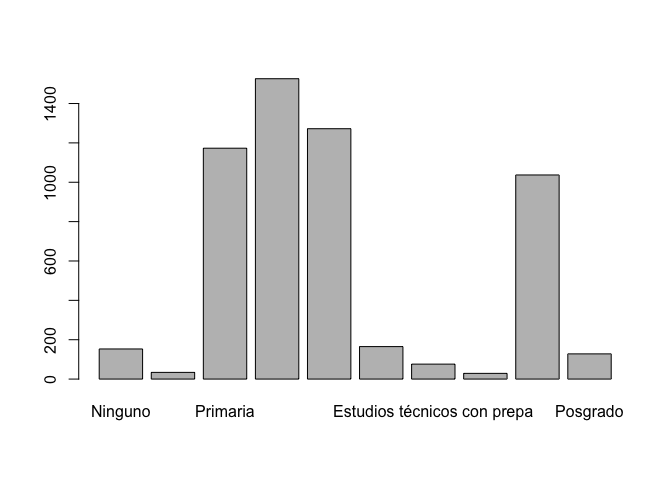<!-- -->

Esto es igual que:

``` r
barplot(table(as_label(ecovid0420$pb3)))
```

<!-- -->

También en prácticas pasadas hemos visto el histograma y el boxplot.

``` r
hist(ICI_2018$esperanza_de_vida)
```

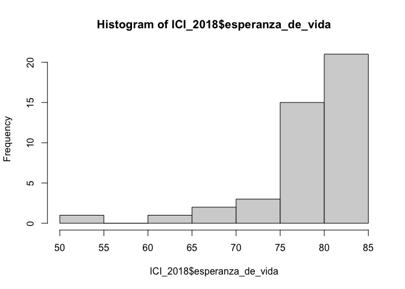<!-- -->

``` r
boxplot(ICI_2018$esperanza_de_vida)
```

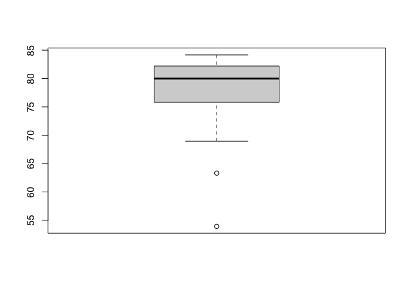<!-- -->

# Gráficos con ggplot

Hoy vamos a presentar a un gran paquete ¡Es de los famosos\! Y tiene más
de diez años.

  - <https://qz.com/1007328/all-hail-ggplot2-the-code-powering-all-those-excellent-charts-is-10-years-old/>

“gg” proviene de “Grammar of Graphics”, funciona un poco como
sintácticamente, de ahí su nombre.

Algunos recursos para aprender ggplot

  - <https://ggplot2-book.org/> hecha por el mero mero.

  - <http://sape.inf.usi.ch/quick-reference/ggplot2>

  - <https://raw.githubusercontent.com/rstudio/cheatsheets/master/data-visualization-2.1.pdf>

Vamos a revisar una presentación que es muy interesante

  - <https://evamaerey.github.io/ggplot2_grammar_guide/ggplot2_grammar_guide.html>

  - <https://huygens.science.uva.nl/ggPlotteR/> Hace gráficos de ggplot
    con la base de datos de Gapminder

# Un lienzo para dibujar

Para hacer un gráfico, ggplot2 tiene el comando “ggplot()”. Hacer
gráficos con esta función tiene una lógica aditiva. Lo ideal es que
iniciemos estableciendo el mapeo estético de nuestro gráfico, con el
comando aes()

``` r
g1<-ecovid0420 %>%
  ggplot(aes(as_label(pb3)))

g1 # imprime el lienzo
```

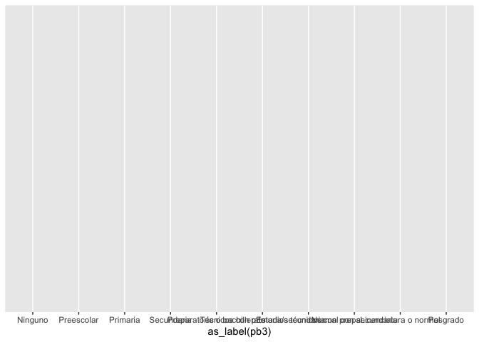<!-- -->

# Gráficos univariados

## Para cualitativas

``` r
g1 + geom_bar()
```

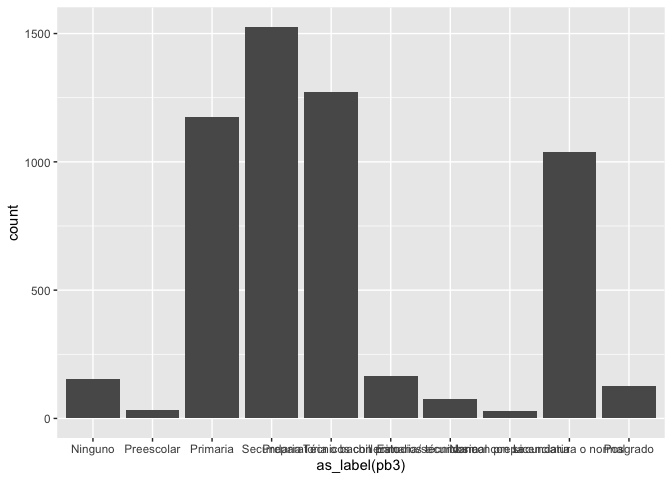<!-- -->

``` r
g1 +  geom_bar(aes(
  fill = as_label(pb3)
  )) # colorea la geometría
```

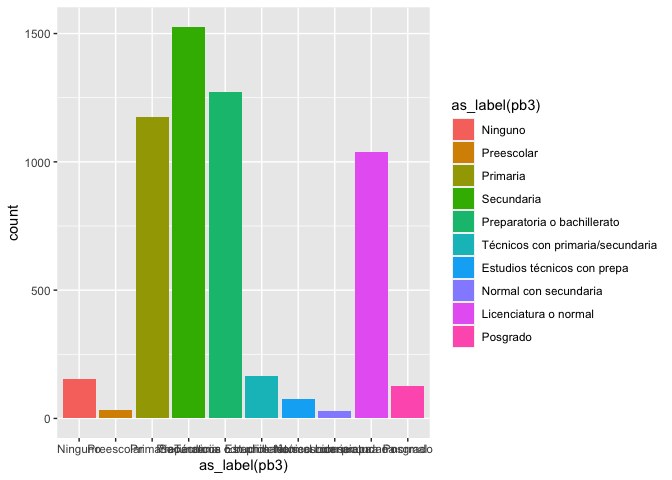<!-- -->

``` r
# Esto es equivalente

ecovid0420 %>%
  ggplot(aes(as_label(pb3),
             fill = as_label(pb3)
             )
         ) + geom_bar()
```

<!-- --> \#\# Para
variables cuantitativas Podemos hacer histogramas y gráficos de
densidad, de manera fácil. La idea es agregar en nuestro “lienzo” una
geometría, un valor para dibujar en él. Esto se agrega con un “+” y con
la figura que se añadirá a nuestro gráfico.

``` r
g2<-ecovid0420 %>%
  ggplot(aes(pb2))

g2 # imprime el lienzo
```

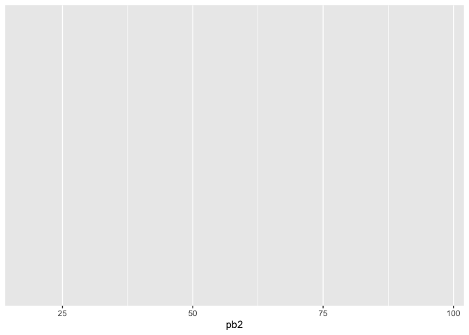<!-- -->

### Histograma

``` r
g2 + geom_histogram() 
```

    ## `stat_bin()` using `bins = 30`. Pick better value with `binwidth`.

    ## Warning: Removed 25 rows containing non-finite values (stat_bin).

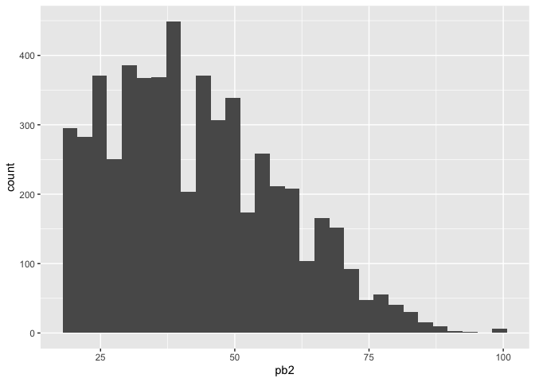<!-- -->

### Densidad

``` r
g2 + geom_density()
```

    ## Warning: Removed 25 rows containing non-finite values (stat_density).

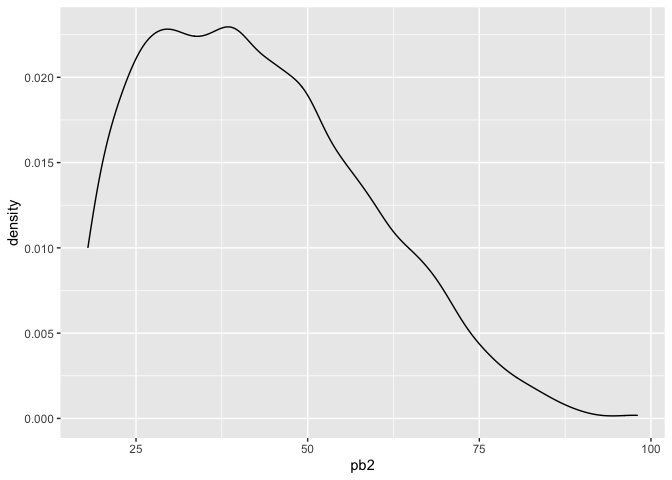<!-- -->

# Gráficos bivariados

## Cuali-cuali

``` r
g1 +  geom_bar(aes(fill = as_label(pb1)),
              position="dodge") #pone las categorías lado a lado y no apiladas
```

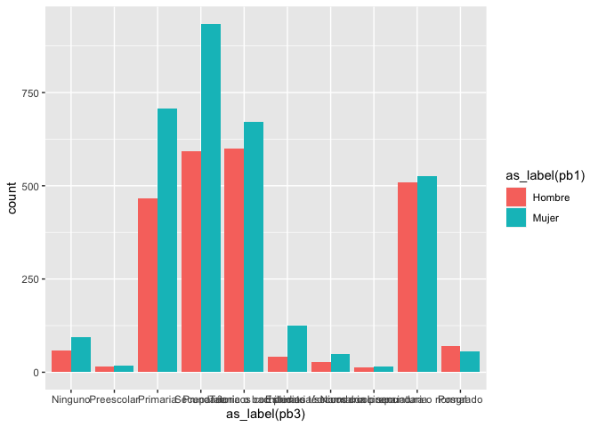<!-- -->

Otra manera interesante de observar estas variables, es que estándo
apiladas, cada categoría de escolaridad se entendiera como una unidad:

``` r
g_bivariado <- g1 +  geom_bar(aes(fill = as_label(pb1)),
              position="fill") # cada categoría "llena" a una unidad

g_bivariado
```

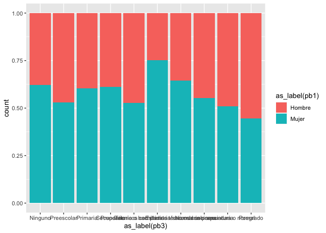<!-- -->

Escalas de color: RcolorBrewer es el más famoso.

``` r
g_bivariado + scale_fill_brewer(palette = "Dark2")
```

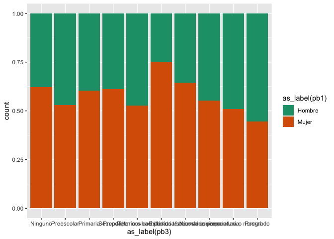<!-- -->

Cambiamos el tema:

``` r
g_bivariado + scale_fill_brewer(palette = "Dark2") + theme_minimal()
```

<!-- -->

# Un atajo “esquisse”

Si la lógica de las capas y lienzos parece un poco complicada para
graficar con ggplot, el paquete “esquisse” tiene un complemento. Cuando
lo instalamos con pacman más arriba, se puede observar el complemento:

``` r
library(esquisse)
```

Hoy desde el complemento podemos acceder a el siguiente menú y
seleccionar nuestra base.

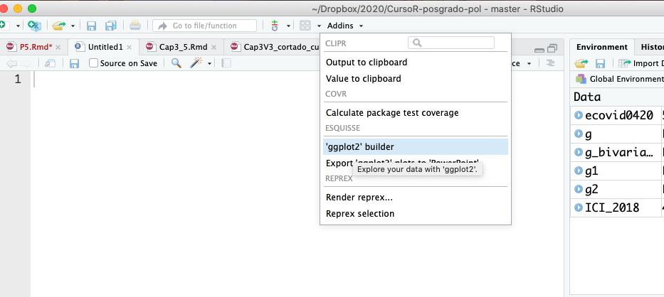

Una vez seleccionada, puedes hacer “drag and drop” de las variables y
elegir el tipo de gráfico, incluso puedes hacer filtro con las variables
disponibles

Puedes exportar esto a una imagen, a powerpoint o como código a ejecutar
en RStudio. Esta herramienta es muy útil para irnos acostumbrando al
código de ggplot que puede ser bastante complicado en los primeros
acercamientos

# Ejercicio

  - Realiza un gráfico de tu agrado, con las variables que te sientes
    cómoda o cómodo, en la base de datos de tu elección
  - Módificalo usando el paquete esquisse.
  - Enviálo a la siguiente liga (el script, así como la imagen)

<https://forms.gle/BnMo7ftXJWX2EMbMA>

¡El martes haremos votación de los mejeres gráficos\!
