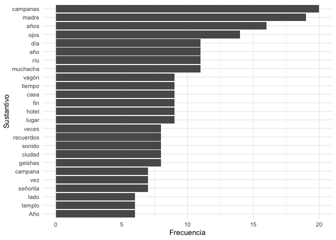
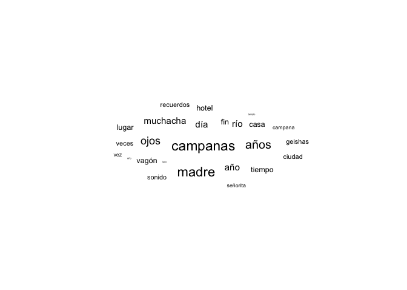
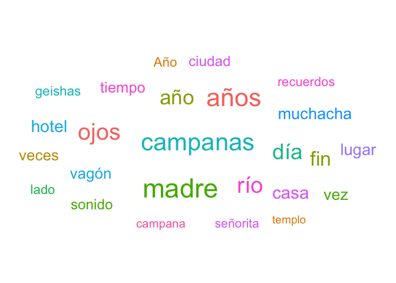
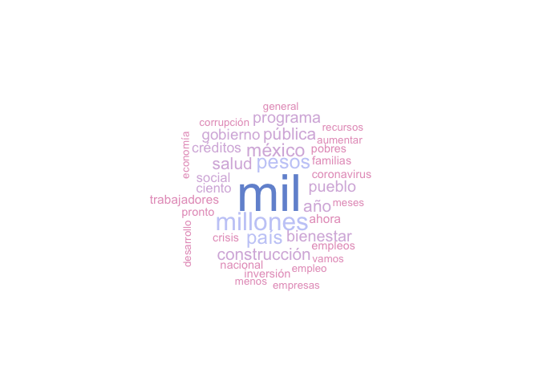

Importación de texto y un poco de análisis
================
AE
02/09/2020

## Paquetería

``` r
rm(list=ls()) ### borra objetos en el ambiente

if (!require("pacman")) install.packages("pacman") # instala pacman si se requiere
```

    ## Loading required package: pacman

``` r
#cargan los paquetes necesario. No se utilizan todos
pacman::p_load(tidyverse, tm, NLP, SnowballC, wordcloud, ggwordcloud,
               quanteda, udpipe, 
               sjlabelled, RColorBrewer, readxl, janitor, textrank,
               broom, epubr, pdftools, wesanderson)
```

## Insumos - ¿dónde están?

Vamos a guardar los “caminos” dónde están los archivos con los que vamos
a trabajar en objetos. R es un lenguaje de programación por objetos.
Tenemos que declarar la información en objetos para poderla utilizar

``` r
## Insumos
path1<-"./datos/kawabata.epub" # formato epub
path2<-"./datos/lobo_antunes.pdf" #formato pdf
path3<-"./datos/amlo_abri.txt" #formato txt
```

Para lo que trabajan desde otro proyecto: Para el insumo 1 tienen que
hacer el upload a su proyecto e importarlo. Para los otros dos será
necesario sólo hacer un cambio

``` r
url2 <- "https://github.com/aniuxa/CursoR-posgrado-pol/raw/master/datos/lobo_antunes.pdf"
url3 <- "https://github.com/aniuxa/CursoR-posgrado-pol/raw/master/datos/amlo_abri.txt"
```

Sustituir en lo que sigue de la práctica “path” con “url”

# Tokenización y revisión UPOS

## Importando modelo de tokenización

``` r
udmodel <- udpipe_download_model(language = "spanish")  # esto trabaja con la estructura del español
```

    ## Downloading udpipe model from https://raw.githubusercontent.com/jwijffels/udpipe.models.ud.2.4/master/inst/udpipe-ud-2.4-190531/spanish-gsd-ud-2.4-190531.udpipe to /Users/anaescoto/Dropbox/2020/CursoR-posgrado-pol/spanish-gsd-ud-2.4-190531.udpipe

    ## Visit https://github.com/jwijffels/udpipe.models.ud.2.4 for model license details

## Formato epub

Vamos a importar un libro desde su formato epub. Este formato es mejor
que el de pdf porque no tenemos tantos cortes por páginas.

``` r
epub_head(path1) # muestra lo primero
```

    ## # A tibble: 25 x 2
    ##    section           text                                                       
    ##    <chr>             <chr>                                                      
    ##  1 Section0018.xhtml "Cuando Keiko llegó a la casa de té de Ofusa encont"       
    ##  2 cubierta.xhtml    ""                                                         
    ##  3 sinopsis.xhtml    " \n\n  Impulsado por la nostalgia, Oki Toshio, un es"     
    ##  4 titulo.xhtml      "Yasunari Kawabata\n\n  Lo bello y lo triste\n\n  美しさと哀"…
    ##  5 info.xhtml        "Título original:美しさと哀しみと (Utsukushisa to kanashimi"…
    ##  6 dedicatoria.xhtml "Lo bello y lo triste"                                     
    ##  7 Section0002.xhtml "Eran seis las butacas giratorias que se alineaban "       
    ##  8 Section0004.xhtml "Oki se había detenido en una colina, con la mirada"       
    ##  9 Section0006.xhtml "Otoko proyectaba llevar a Keiko al templo del mont"       
    ## 10 Section0008.xhtml "Cuando se cansaba de escribir o cuando una novela "       
    ## # … with 15 more rows

``` r
epub_meta(path1) # muestra el meta-data del libro
```

    ## # A tibble: 1 x 9
    ##   identifier title subject creator description contributor publisher date 
    ##   <chr>      <chr> <chr>   <chr>   <chr>       <chr>       <chr>     <chr>
    ## 1 urn:uuid:… Lo b… Drama,… Yasuna… Impulsado … Nélida M. … Emecé Li… 1965…
    ## # … with 1 more variable: language <chr>

``` r
x <- epub(path1) # Importa todo el libro en el objeto x, pero no queremos todo
x
```

    ## # A tibble: 1 x 10
    ##   identifier title subject creator description contributor publisher date 
    ##   <chr>      <chr> <chr>   <chr>   <chr>       <chr>       <chr>     <chr>
    ## 1 urn:uuid:… Lo b… Drama,… Yasuna… Impulsado … Nélida M. … Emecé Li… 1965…
    ## # … with 2 more variables: language <chr>, data <list>

``` r
class(x)
```

    ## [1] "tbl_df"     "tbl"        "data.frame"

Para los que trabajan en otro proyecto, descomentar y seleccionar el
archivo

``` r
#x<-epub(file.choose())
```

Como observamos lo que queremos son las secciones que realmente tiene
nuestro texto (¡aunque quizás también analizar contraportadas sea otro
tema de análisis\!)

``` r
x$data # esto muestra que aquí adentro está lo que queremos
```

    ## [[1]]
    ## # A tibble: 25 x 4
    ##    section        text                                               nword nchar
    ##    <chr>          <chr>                                              <int> <int>
    ##  1 Section0018.x… "Cuando Keiko llegó a la casa de té de Ofusa enco…  7436 43690
    ##  2 cubierta.xhtml ""                                                     0     0
    ##  3 sinopsis.xhtml " \n\n  Impulsado por la nostalgia, Oki Toshio, u…    92   540
    ##  4 titulo.xhtml   "Yasunari Kawabata\n\n  Lo bello y lo triste\n\n …    11    86
    ##  5 info.xhtml     "Título original:美しさと哀しみと (Utsukushisa to kanashi…    30   285
    ##  6 dedicatoria.x… "Lo bello y lo triste"                                 5    20
    ##  7 Section0002.x… "Eran seis las butacas giratorias que se alineaba…  5990 34930
    ##  8 Section0004.x… "Oki se había detenido en una colina, con la mira…  7454 43536
    ##  9 Section0006.x… "Otoko proyectaba llevar a Keiko al templo del mo…  4601 27247
    ## 10 Section0008.x… "Cuando se cansaba de escribir o cuando una novel…  3564 20724
    ## # … with 15 more rows

``` r
epub_kaw<-x$data[[1]] # Nos quedamos con esa base de datos
epub_kaw<-epub_kaw[7, ]  # Nos quedamos con el cuento Campanas del templo
```

## Nuestra obra tokenizada

Una vez que ya tenemos un objeto con la información que necesitamos,
usaremos nuestro modelo para tokenizarla. Este resultado lo guardaremos
en un objeto.

``` r
kawabata<-udpipe(x = paste(epub_kaw$text), #paste nos asegura que se pegue como caracter
                      object=udmodel) #"tokeniza" el texto
```

Vamos a revisar ese objeto “tokenizado”

``` r
glimpse(kawabata)
```

    ## Rows: 7,073
    ## Columns: 17
    ## $ doc_id        <chr> "doc1", "doc1", "doc1", "doc1", "doc1", "doc1", "doc1",…
    ## $ paragraph_id  <int> 1, 1, 1, 1, 1, 1, 1, 1, 1, 1, 1, 1, 1, 1, 1, 1, 1, 1, 1…
    ## $ sentence_id   <int> 1, 1, 1, 1, 1, 1, 1, 1, 1, 1, 1, 1, 1, 1, 1, 1, 1, 1, 1…
    ## $ sentence      <chr> "Eran seis las butacas giratorias que se alineaban sobr…
    ## $ start         <int> 1, 6, 11, 15, 23, 34, 38, 41, 51, 57, 60, 65, 73, NA, N…
    ## $ end           <int> 4, 9, 13, 21, 32, 36, 39, 49, 55, 58, 63, 71, 75, NA, N…
    ## $ term_id       <int> 1, 2, 3, 4, 5, 6, 7, 8, 9, 10, 11, 12, 13, 14, 15, 16, …
    ## $ token_id      <chr> "1", "2", "3", "4", "5", "6", "7", "8", "9", "10", "11"…
    ## $ token         <chr> "Eran", "seis", "las", "butacas", "giratorias", "que", …
    ## $ lemma         <chr> "ser", "6", "el", "butaco", "giratoria", "que", "él", "…
    ## $ upos          <chr> "VERB", "NUM", "DET", "NOUN", "ADJ", "SCONJ", "PRON", "…
    ## $ xpos          <chr> NA, NA, NA, NA, NA, NA, NA, NA, NA, NA, NA, NA, NA, NA,…
    ## $ feats         <chr> "Mood=Ind|Number=Plur|Person=3|Tense=Pres|VerbForm=Fin"…
    ## $ head_token_id <chr> "0", "1", "4", "1", "4", "8", "8", "4", "11", "11", "8"…
    ## $ dep_rel       <chr> "root", "obl", "det", "nsubj", "amod", "mark", "iobj", …
    ## $ deps          <chr> NA, NA, NA, NA, NA, NA, NA, NA, NA, NA, NA, NA, NA, NA,…
    ## $ misc          <chr> NA, NA, NA, NA, NA, NA, NA, NA, NA, NA, NA, NA, NA, NA,…

Nos vamos a concentrar en la variable “upos”, proviende de UPOS
*Universal Parts of Speech*
<https://universaldependencies.org/u/pos/index.html>

``` r
kawabata %>% 
  tabyl(upos) # esto nos da un tabulado
```

    ##   upos    n      percent valid_percent
    ##    ADJ  353 0.0499081012  0.0510263082
    ##    ADP  951 0.1344549696  0.1374674761
    ##    ADV  352 0.0497667185  0.0508817577
    ##    AUX  259 0.0366181253  0.0374385661
    ##  CCONJ  194 0.0274282483  0.0280427869
    ##    DET  964 0.1362929450  0.1393466320
    ##   INTJ    5 0.0007069136  0.0007227522
    ##   NOUN 1173 0.1658419341  0.1695576756
    ##    NUM   50 0.0070691362  0.0072275224
    ##   PRON  433 0.0612187191  0.0625903440
    ##  PROPN  243 0.0343560017  0.0351257589
    ##  PUNCT  779 0.1101371412  0.1126047991
    ##  SCONJ  225 0.0318111127  0.0325238508
    ##   VERB  928 0.1312031670  0.1341428158
    ##      X    9 0.0012724445  0.0013009540
    ##   <NA>  155 0.0219143221            NA

## Revisando elementos UPOS

### Nombres

Vamos a revisar un tipo especial, los sustantivos. “NOUN”, en inglés

Veamos para el caso de nuestra primera novela

``` r
stats<- kawabata %>% 
  filter(upos=="NOUN")

stats.freq <- txt_freq(stats$token)
stats.freq$key <- factor(stats.freq$key, levels = rev(stats.freq$key)) # ordena

stats.freq[1:25,] %>% 
  ggplot(aes(x=key, y=freq)) +geom_bar(stat="identity") + 
  coord_flip() + labs(y="Frecuencia", x="Sustantivo") + theme_minimal()
```

<!-- -->

### Nube de sustantivos

Con esto podemos hacer una nube, esas son famosas:

``` r
set.seed(42) # tiene un elemento aleatorio

stats.freq[1:25,] %>% 
  ggplot(aes(label=key, size=freq)) +  geom_text_wordcloud() +
  theme_minimal()
```

<!-- --> La vamos a poner
más chula:

``` r
stats.freq[1:25,] %>% 
    ggplot(
        aes(
        label =key, size = freq,
        color = factor(sample.int(15, nrow(stats.freq[1:25,]), replace = TRUE))
        )
    ) +
      geom_text_wordcloud_area() +
      scale_size_area(max_size = 12) +
      theme_minimal()
```

<!-- -->

Otra paquetería, es más fácil pero menos editable

``` r
set.seed(1234)

paleta_color<-wes_palette(n=5,
                          name="Darjeeling1",
                          type="continuous")

wordcloud(words = stats.freq$key, freq = stats.freq$freq,
          min.freq = 5,
          max.words=200, 
          random.order=FALSE, 
          colors=paleta_color)
```

<!-- -->

## Adjetivos

Vamos a encontrar los adjetivos más usados

``` r
stats<- kawabata %>% 
  filter(upos=="ADJ") #checa que esto sobreescribe los objetos que teníamos

stats.freq <- txt_freq(stats$token)
stats.freq$key <- factor(stats.freq$key, levels = rev(stats.freq$key)) # ordena

stats.freq[1:25,] %>% 
  ggplot(aes(x=key, y=freq)) +geom_bar(stat="identity") + 
  coord_flip() + labs(y="Frecuencia", x="Adjetivo") + theme_minimal()
```

<!-- -->

## Todas las palabras

Cuando analizamos texto hay palabras que son muy comunes.

``` r
#Elegir palabras comunes
stopwords("spanish") # de la paquetería quanteda
```

    ##   [1] "de"           "la"           "que"          "el"           "en"          
    ##   [6] "y"            "a"            "los"          "del"          "se"          
    ##  [11] "las"          "por"          "un"           "para"         "con"         
    ##  [16] "no"           "una"          "su"           "al"           "lo"          
    ##  [21] "como"         "más"          "pero"         "sus"          "le"          
    ##  [26] "ya"           "o"            "este"         "sí"           "porque"      
    ##  [31] "esta"         "entre"        "cuando"       "muy"          "sin"         
    ##  [36] "sobre"        "también"      "me"           "hasta"        "hay"         
    ##  [41] "donde"        "quien"        "desde"        "todo"         "nos"         
    ##  [46] "durante"      "todos"        "uno"          "les"          "ni"          
    ##  [51] "contra"       "otros"        "ese"          "eso"          "ante"        
    ##  [56] "ellos"        "e"            "esto"         "mí"           "antes"       
    ##  [61] "algunos"      "qué"          "unos"         "yo"           "otro"        
    ##  [66] "otras"        "otra"         "él"           "tanto"        "esa"         
    ##  [71] "estos"        "mucho"        "quienes"      "nada"         "muchos"      
    ##  [76] "cual"         "poco"         "ella"         "estar"        "estas"       
    ##  [81] "algunas"      "algo"         "nosotros"     "mi"           "mis"         
    ##  [86] "tú"           "te"           "ti"           "tu"           "tus"         
    ##  [91] "ellas"        "nosotras"     "vosotros"     "vosotras"     "os"          
    ##  [96] "mío"          "mía"          "míos"         "mías"         "tuyo"        
    ## [101] "tuya"         "tuyos"        "tuyas"        "suyo"         "suya"        
    ## [106] "suyos"        "suyas"        "nuestro"      "nuestra"      "nuestros"    
    ## [111] "nuestras"     "vuestro"      "vuestra"      "vuestros"     "vuestras"    
    ## [116] "esos"         "esas"         "estoy"        "estás"        "está"        
    ## [121] "estamos"      "estáis"       "están"        "esté"         "estés"       
    ## [126] "estemos"      "estéis"       "estén"        "estaré"       "estarás"     
    ## [131] "estará"       "estaremos"    "estaréis"     "estarán"      "estaría"     
    ## [136] "estarías"     "estaríamos"   "estaríais"    "estarían"     "estaba"      
    ## [141] "estabas"      "estábamos"    "estabais"     "estaban"      "estuve"      
    ## [146] "estuviste"    "estuvo"       "estuvimos"    "estuvisteis"  "estuvieron"  
    ## [151] "estuviera"    "estuvieras"   "estuviéramos" "estuvierais"  "estuvieran"  
    ## [156] "estuviese"    "estuvieses"   "estuviésemos" "estuvieseis"  "estuviesen"  
    ## [161] "estando"      "estado"       "estada"       "estados"      "estadas"     
    ## [166] "estad"        "he"           "has"          "ha"           "hemos"       
    ## [171] "habéis"       "han"          "haya"         "hayas"        "hayamos"     
    ## [176] "hayáis"       "hayan"        "habré"        "habrás"       "habrá"       
    ## [181] "habremos"     "habréis"      "habrán"       "habría"       "habrías"     
    ## [186] "habríamos"    "habríais"     "habrían"      "había"        "habías"      
    ## [191] "habíamos"     "habíais"      "habían"       "hube"         "hubiste"     
    ## [196] "hubo"         "hubimos"      "hubisteis"    "hubieron"     "hubiera"     
    ## [201] "hubieras"     "hubiéramos"   "hubierais"    "hubieran"     "hubiese"     
    ## [206] "hubieses"     "hubiésemos"   "hubieseis"    "hubiesen"     "habiendo"    
    ## [211] "habido"       "habida"       "habidos"      "habidas"      "soy"         
    ## [216] "eres"         "es"           "somos"        "sois"         "son"         
    ## [221] "sea"          "seas"         "seamos"       "seáis"        "sean"        
    ## [226] "seré"         "serás"        "será"         "seremos"      "seréis"      
    ## [231] "serán"        "sería"        "serías"       "seríamos"     "seríais"     
    ## [236] "serían"       "era"          "eras"         "éramos"       "erais"       
    ## [241] "eran"         "fui"          "fuiste"       "fue"          "fuimos"      
    ## [246] "fuisteis"     "fueron"       "fuera"        "fueras"       "fuéramos"    
    ## [251] "fuerais"      "fueran"       "fuese"        "fueses"       "fuésemos"    
    ## [256] "fueseis"      "fuesen"       "siendo"       "sido"         "tengo"       
    ## [261] "tienes"       "tiene"        "tenemos"      "tenéis"       "tienen"      
    ## [266] "tenga"        "tengas"       "tengamos"     "tengáis"      "tengan"      
    ## [271] "tendré"       "tendrás"      "tendrá"       "tendremos"    "tendréis"    
    ## [276] "tendrán"      "tendría"      "tendrías"     "tendríamos"   "tendríais"   
    ## [281] "tendrían"     "tenía"        "tenías"       "teníamos"     "teníais"     
    ## [286] "tenían"       "tuve"         "tuviste"      "tuvo"         "tuvimos"     
    ## [291] "tuvisteis"    "tuvieron"     "tuviera"      "tuvieras"     "tuviéramos"  
    ## [296] "tuvierais"    "tuvieran"     "tuviese"      "tuvieses"     "tuviésemos"  
    ## [301] "tuvieseis"    "tuviesen"     "teniendo"     "tenido"       "tenida"      
    ## [306] "tenidos"      "tenidas"      "tened"

``` r
stop<-stopwords("spanish") # guarda todas esas palabras en un objeto
stop
```

    ##   [1] "de"           "la"           "que"          "el"           "en"          
    ##   [6] "y"            "a"            "los"          "del"          "se"          
    ##  [11] "las"          "por"          "un"           "para"         "con"         
    ##  [16] "no"           "una"          "su"           "al"           "lo"          
    ##  [21] "como"         "más"          "pero"         "sus"          "le"          
    ##  [26] "ya"           "o"            "este"         "sí"           "porque"      
    ##  [31] "esta"         "entre"        "cuando"       "muy"          "sin"         
    ##  [36] "sobre"        "también"      "me"           "hasta"        "hay"         
    ##  [41] "donde"        "quien"        "desde"        "todo"         "nos"         
    ##  [46] "durante"      "todos"        "uno"          "les"          "ni"          
    ##  [51] "contra"       "otros"        "ese"          "eso"          "ante"        
    ##  [56] "ellos"        "e"            "esto"         "mí"           "antes"       
    ##  [61] "algunos"      "qué"          "unos"         "yo"           "otro"        
    ##  [66] "otras"        "otra"         "él"           "tanto"        "esa"         
    ##  [71] "estos"        "mucho"        "quienes"      "nada"         "muchos"      
    ##  [76] "cual"         "poco"         "ella"         "estar"        "estas"       
    ##  [81] "algunas"      "algo"         "nosotros"     "mi"           "mis"         
    ##  [86] "tú"           "te"           "ti"           "tu"           "tus"         
    ##  [91] "ellas"        "nosotras"     "vosotros"     "vosotras"     "os"          
    ##  [96] "mío"          "mía"          "míos"         "mías"         "tuyo"        
    ## [101] "tuya"         "tuyos"        "tuyas"        "suyo"         "suya"        
    ## [106] "suyos"        "suyas"        "nuestro"      "nuestra"      "nuestros"    
    ## [111] "nuestras"     "vuestro"      "vuestra"      "vuestros"     "vuestras"    
    ## [116] "esos"         "esas"         "estoy"        "estás"        "está"        
    ## [121] "estamos"      "estáis"       "están"        "esté"         "estés"       
    ## [126] "estemos"      "estéis"       "estén"        "estaré"       "estarás"     
    ## [131] "estará"       "estaremos"    "estaréis"     "estarán"      "estaría"     
    ## [136] "estarías"     "estaríamos"   "estaríais"    "estarían"     "estaba"      
    ## [141] "estabas"      "estábamos"    "estabais"     "estaban"      "estuve"      
    ## [146] "estuviste"    "estuvo"       "estuvimos"    "estuvisteis"  "estuvieron"  
    ## [151] "estuviera"    "estuvieras"   "estuviéramos" "estuvierais"  "estuvieran"  
    ## [156] "estuviese"    "estuvieses"   "estuviésemos" "estuvieseis"  "estuviesen"  
    ## [161] "estando"      "estado"       "estada"       "estados"      "estadas"     
    ## [166] "estad"        "he"           "has"          "ha"           "hemos"       
    ## [171] "habéis"       "han"          "haya"         "hayas"        "hayamos"     
    ## [176] "hayáis"       "hayan"        "habré"        "habrás"       "habrá"       
    ## [181] "habremos"     "habréis"      "habrán"       "habría"       "habrías"     
    ## [186] "habríamos"    "habríais"     "habrían"      "había"        "habías"      
    ## [191] "habíamos"     "habíais"      "habían"       "hube"         "hubiste"     
    ## [196] "hubo"         "hubimos"      "hubisteis"    "hubieron"     "hubiera"     
    ## [201] "hubieras"     "hubiéramos"   "hubierais"    "hubieran"     "hubiese"     
    ## [206] "hubieses"     "hubiésemos"   "hubieseis"    "hubiesen"     "habiendo"    
    ## [211] "habido"       "habida"       "habidos"      "habidas"      "soy"         
    ## [216] "eres"         "es"           "somos"        "sois"         "son"         
    ## [221] "sea"          "seas"         "seamos"       "seáis"        "sean"        
    ## [226] "seré"         "serás"        "será"         "seremos"      "seréis"      
    ## [231] "serán"        "sería"        "serías"       "seríamos"     "seríais"     
    ## [236] "serían"       "era"          "eras"         "éramos"       "erais"       
    ## [241] "eran"         "fui"          "fuiste"       "fue"          "fuimos"      
    ## [246] "fuisteis"     "fueron"       "fuera"        "fueras"       "fuéramos"    
    ## [251] "fuerais"      "fueran"       "fuese"        "fueses"       "fuésemos"    
    ## [256] "fueseis"      "fuesen"       "siendo"       "sido"         "tengo"       
    ## [261] "tienes"       "tiene"        "tenemos"      "tenéis"       "tienen"      
    ## [266] "tenga"        "tengas"       "tengamos"     "tengáis"      "tengan"      
    ## [271] "tendré"       "tendrás"      "tendrá"       "tendremos"    "tendréis"    
    ## [276] "tendrán"      "tendría"      "tendrías"     "tendríamos"   "tendríais"   
    ## [281] "tendrían"     "tenía"        "tenías"       "teníamos"     "teníais"     
    ## [286] "tenían"       "tuve"         "tuviste"      "tuvo"         "tuvimos"     
    ## [291] "tuvisteis"    "tuvieron"     "tuviera"      "tuvieras"     "tuviéramos"  
    ## [296] "tuvierais"    "tuvieran"     "tuviese"      "tuvieses"     "tuviésemos"  
    ## [301] "tuvieseis"    "tuviesen"     "teniendo"     "tenido"       "tenida"      
    ## [306] "tenidos"      "tenidas"      "tened"

De nuestro UPOS tenemos algunos que no vamos a querer

``` r
no_upos<-c("X","SYM","PUNCT")
```

``` r
stats<- kawabata %>% 
  filter(!upos%in%no_upos) %>%  #selecciona todos menos estos tipos
  mutate(token=tolower(token)) %>% # cambia a que token no tenga mayúsculas
  filter(!token%in%stop)  # selecciona todas las palabras menos las que están en nuestro vector "stop"

stats.freq <- txt_freq(stats$token)
stats.freq$key <- factor(stats.freq$key, levels = rev(stats.freq$key)) # ordena
```

Podemos graficar esto:

``` r
stats.freq[1:25,] %>% 
  ggplot(aes(x=key, y=freq)) +geom_bar(stat="identity") + 
  coord_flip() + labs(y="Frecuencia", x="Palabra") + theme_minimal()
```

<!-- -->

Para la nube de todas la palabras

``` r
paleta_color<-wes_palette(n=5,
                          name="Darjeeling1",
                          type="continuous")

wordcloud(words = stats.freq$key, freq = stats.freq$freq,
          min.freq = 5,
          max.words=120, # aquí le cambié
          random.order=FALSE, 
          colors=paleta_color)
```

<!-- -->

### Correlaciones

``` r
kawabata$id <- unique_identifier(kawabata, fields = c("sentence_id", "doc_id"))

dtm <- kawabata %>% 
  filter(upos %in% c("NOUN", "ADJ")) # objeto de solo nombres y adjetivos

dtm <- dtm %>% 
  document_term_frequencies( document = "id", term = "lemma")
dtm <- document_term_matrix(dtm)
dtm <- dtm_remove_lowfreq(dtm, minfreq = 5)

termcorrelations <- dtm_cor(dtm)
y <- as_cooccurrence(termcorrelations)
y <- subset(y, term1 < term2 & abs(cooc) > 0.2)
y <- y[order(abs(y$cooc), decreasing = TRUE), ]
head(y,24)
```

    ##           term1    term2      cooc
    ## 3002   señorita     Ueno 0.9241535
    ## 1863    corbata     nudo 0.3892473
    ## 2730    campana   templo 0.3884721
    ## 2670    antiguo   sonido 0.3736356
    ## 3077     butaca    vagón 0.3704690
    ## 2672    campana   sonido 0.3547466
    ## 525      butaca  extremo 0.3526933
    ## 3313    corbata      voz 0.3526933
    ## 1759      junto    mujer 0.3392677
    ## 2046       hora  primero 0.2731984
    ## 995   discípula    joven 0.2649521
    ## 2773     sonido   templo 0.2646098
    ## 1700      joven muchacha 0.2586729
    ## 1813 habitación     niño 0.2376241
    ## 3230   recuerdo     vida 0.2242994
    ## 3288   recuerdo    viejo 0.2242994
    ## 1758      joven    mujer 0.2160554
    ## 2806      largo   tiempo 0.2121752
    ## 3024        día   último 0.2077964
    ## 3171      radio      vez 0.2077964
    ## 2690      largo   sonido 0.2035735
    ## 3017        año   último 0.2021044

Este objeto y, puede ser muy útil de exportar a un formato compatible
con Excel:

``` r
write_csv(y, "kawabata_corr.csv") # lo guarda en nuestro directorio
```

# Importación desde otros formatos

El formato epub no es el único. Vamos a importar texto desde otro
formato y luego tokenizarlo.

## Desde pdf

``` r
lobo_pdf <- pdf_text(path2)
```

Esto nos da un vector de caracteres y no una matriz

``` r
#Es un vector de caracteres, no una matrix
lobo_pdf[19]
```

    ## [1] "CAPÍTULO PRIMERO\n¿Tendré que remendar esto con palabras o hablar de lo que ocurrió\nrealmente, no aquí, sino en Lisboa y en Luanda cinco años atrás? Cinco\naños es mucho tiempo\nlo sé\npero a veces, al acabar el día, en esta hacienda de la que no me ocupo\n(nadie se ocupa, se ocupan los pájaros que van devorando sin prisa,\nmirándome de lado, lo que resta del girasol y el algodón)\na cincuenta o sesenta kilómetros de donde ocurrió todo, en esta\nconstrucción colonial que perteneció al delegado\na un delegado regional cualquiera que no llegué a conocer y en la\nangustia de la huida\n(huida hacia dónde si no se huye de Angola, solo demasiado tarde\ncomprendí que no se huye de Angola, Europa demasiado lejos y después\nla indiferencia, el cansancio, la edad porque nos gastamos tan deprisa\nen África, un encogimiento de hombros, una resignación de\n—¿Y después?)\nen esta construcción colonial en la que un delegado regional cualquiera\ndejó la foto de sus hijos que apenas se distinguen en el marco de\nesparadrapo y que por la noche, después de la segunda botella,\ncomienzo a imaginar míos, pensando que me pertenecen tal como me\npertenece la casa por no pertenecer a nadie, una sala, una cocina, una\nducha fuera, es decir, un cubo boca abajo que un clavo balancea desde\nun alambre torcido, y una aldea de viejos\n(lo que queda son viejos)\nbuscando sapos en los charcos, separando la tierra con la esperanza de\nserpientes que se fríen en un cazo, robando el girasol y el algodón a los\npájaros y a mí, a veces, al acabar el día, cuando la primera botella aún\nno inició su trabajo en favor de la indiferencia y la memoria y el\nremordimiento siguen doliéndome\n(porque el infierno consiste en acordarnos durante toda la eternidad\n¿no es verdad?\n                                                                       19/661\n"

Vamos a tokenizar esta página

``` r
lobo_p18<-lobo_pdf[18]
lobo<-udpipe(x = lobo_p18, object=udmodel) #"tokeniza" el texto
```

## Desde .txt

``` r
text <- readLines(path3)
```

    ## Warning in readLines(path3): incomplete final line found on './datos/
    ## amlo_abri.txt'

``` r
amlo<-udpipe(x = text, object=udmodel) #"tokeniza" el texto
```

Una nubecita de este discurso

``` r
stats<- amlo%>% 
  filter(!upos%in%no_upos) %>%  #selecciona todos menos estos tipos
  mutate(token=tolower(token)) %>% # cambia a que token no tenga mayúsculas
  filter(!token%in%stop)  # selecciona todas las palabras menos las que están en nuestro vector "stop"

stats.freq <- txt_freq(stats$token)
stats.freq$key <- factor(stats.freq$key, levels = rev(stats.freq$key)) # ordena
```

Hoy sí, la nube

``` r
paleta_color<-wes_palette(n=7,
                          name="GrandBudapest2",
                          type="continuous")

wordcloud(words = stats.freq$key, freq = stats.freq$freq,
          min.freq = 5,
          max.words=120, # aquí le cambié
          random.order=FALSE, 
          colors=paleta_color)
```

    ## Warning in wordcloud(words = stats.freq$key, freq = stats.freq$freq, min.freq =
    ## 5, : <html><body>you could not be fit on page. It will not be plotted.

    ## Warning in wordcloud(words = stats.freq$key, freq = stats.freq$freq, min.freq =
    ## 5, : https://raw.githubusercontent.com/aniuxa/cursor-posgrado-pol/master/datos/
    ## amlo_abri.txt could not be fit on page. It will not be plotted.

    ## Warning in wordcloud(words = stats.freq$key, freq = stats.freq$freq, min.freq
    ## = 5, : >redirected</a>.</body></html> could not be fit on page. It will not be
    ## plotted.

<!-- -->

# Inspiración

Aquí algunos sitios relevantes:

  - <https://bnosac.github.io/udpipe/docs/doc1.html>

  - <https://content-analysis-with-r.com/0-introduction.html>

  - <http://www.sthda.com/english/wiki/text-mining-and-word-cloud-fundamentals-in-r-5-simple-steps-you-should-know>
